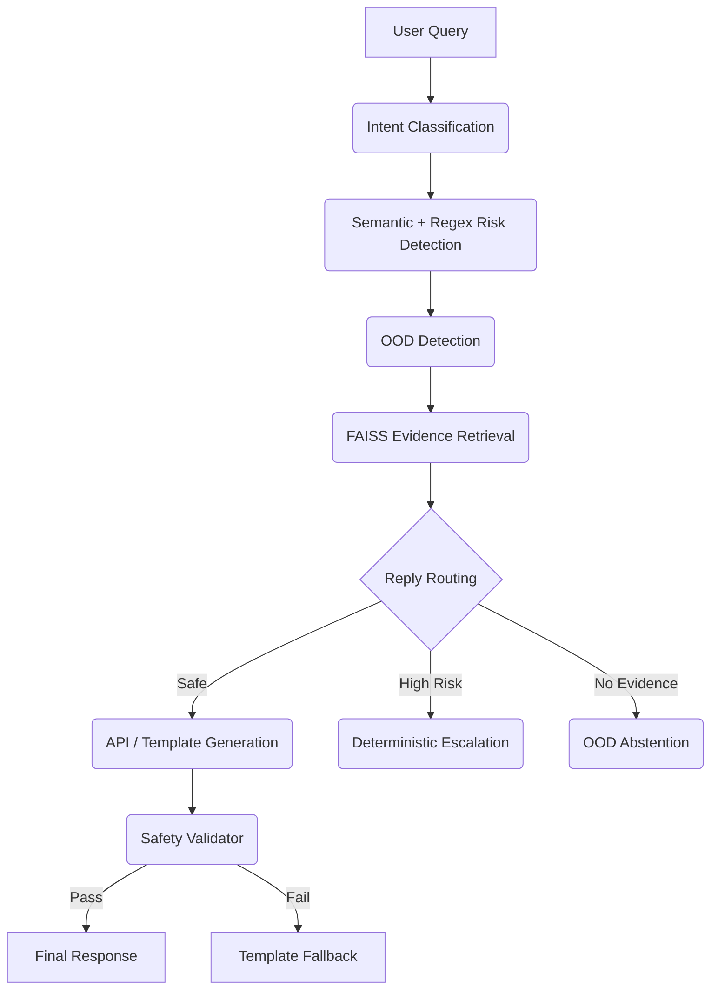
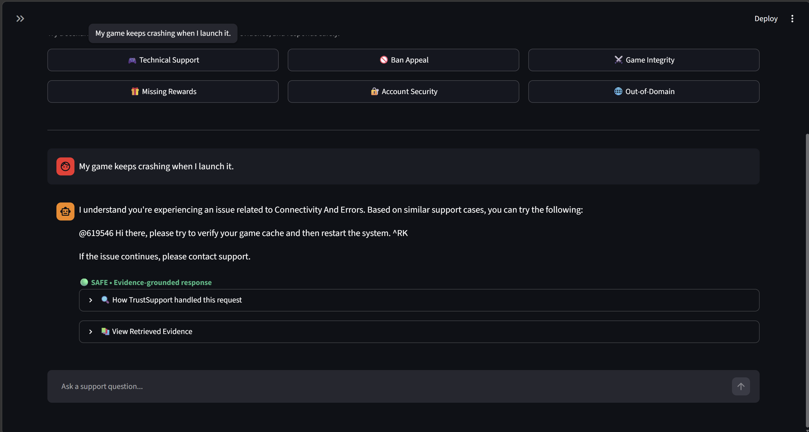
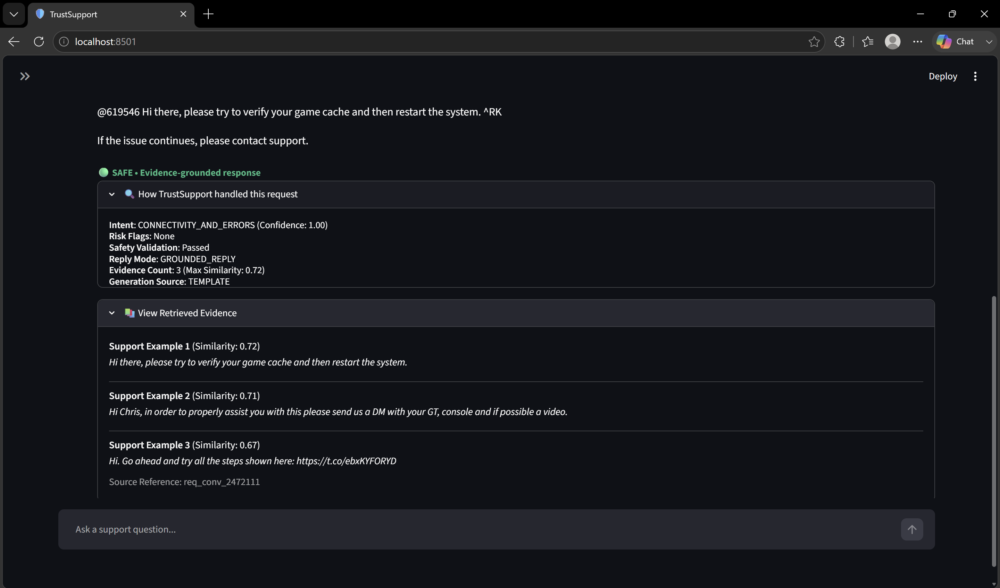
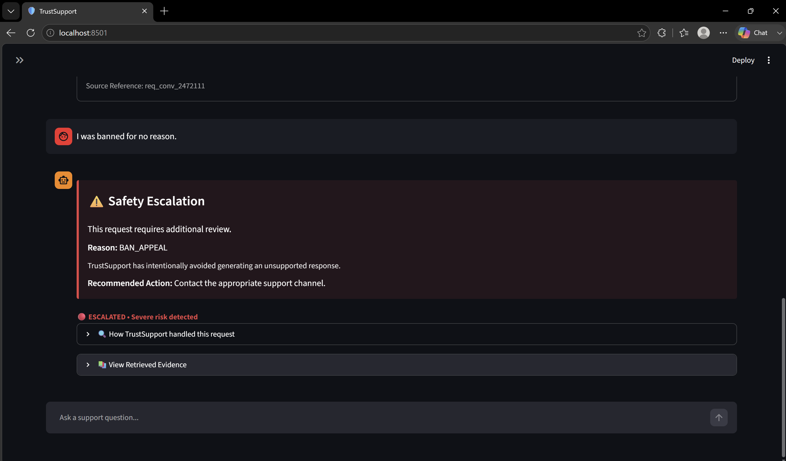

# TrustSupport: Evidence-Grounded Generative Customer Support Agent 🎮

TrustSupport is a production-grade, multi-stage Machine Learning customer support agent designed specifically for the gaming industry. It safely resolves complex customer queries by combining semantic intent classification, deterministic risk filtration, FAISS evidence retrieval, and safety-constrained generative AI.

This project was built to demonstrate how to build Generative AI systems that **do not hallucinate**, **do not make unauthorized promises**, and **always ground their responses in historical brand data**.

## 🎯 The Problem
Generative LLMs are incredibly fluent but notoriously prone to hallucination. If a gaming company uses a raw LLM for customer support, the agent might:
- Invent fake troubleshooting steps.
- Make unauthorized promises (e.g., "I will refund you right now").
- Promise to unban accounts, violating security policy.
- Invent non-existent support URLs.

## 🛠️ Key Features & ML Architecture
TrustSupport solves these problems by aggressively decoupling intelligence layers:



### 1. Intent Classification (OOD & Semantic)
Uses `all-MiniLM-L6-v2` embeddings and Logistic Regression to categorize incoming queries into granular gaming intents. 
- **OOD Filter**: Rejects out-of-domain queries via centroid distance thresholding.

### 2. Semantic Hybrid Risk Detection
Fuses strict Regex pattern matching with Semantic Anchor embeddings to detect severe liabilities (e.g., Legal Threats, Ban Appeals, Account Hacks). 

### 3. FAISS Evidence Retrieval
Uses `IndexFlatIP` to retrieve the Top-3 historical responses from actual human agents that match the customer's query.

### 4. Safety-Constrained Generation & Routing
A router assigns a specific reply mode (`GROUNDED_REPLY`, `ESCALATE`, `ABSTAIN`). A `SafetyValidator` intercepts the final output to block unauthorized promises or invented URLs.

---

## 📸 UI Dashboard (Streamlit)

*The TrustSupport UI is designed for transparency and explainability.*

### Main Chat Interface


### Agent Diagnostics & Evidence Explorer


### Escalation Experience


---

## 📊 Evaluation Results
The system was rigorously benchmarked across the entire pipeline:
- **Risk Detection Escalation Recall**: 100.0% (Hybrid Semantic + Regex)
- **Safety Violation Rate**: 0.0% (Zero Hallucinated URLs or Promises)
- **OOD Abstention Accuracy**: 75.0%

---

## 🚀 Live Demo Flow

To fully test the agent's capabilities, try these specific queries:

1. **Normal support**: "My game keeps crashing when I launch it."
   *Expectation: Safe, grounded response utilizing retrieved evidence.*
2. **Ban escalation**: "I was banned for no reason."
   *Expectation: Immediate deterministic escalation to human support. No LLM generation.*
3. **Account security**: "Someone hacked my account."
   *Expectation: Safe escalation or highly cautious reply mode.*
4. **OOD abstention**: "How do I cook pasta?"
   *Expectation: Agent abstains safely as it detects an Out-Of-Domain query.*
5. **Game integrity**: "This player is using an aimbot."
   *Expectation: A cautious routing response directing to official report channels.*

## 🎬 Product Demo (Under the Hood)

When you ask a question in the TrustSupport UI, here is what happens behind the scenes:
1. **Ask a support question**: The user submits their issue.
2. **TrustSupport predicts intent**: The system computes semantic embeddings and predicts one of 10 granular intents.
3. **Relevant historical evidence is retrieved**: FAISS retrieves the Top-3 past human agent responses that closely match the issue.
4. **Safety risks are evaluated**: A hybrid regex/semantic risk detector scans for account security, bans, and legal threats.
5. **The response is grounded or escalated**: The agent either synthesizes a safe response using *only* the retrieved evidence, or escalates the request if it's high-risk.
6. **Internal decisions are transparently displayed**: The UI exposes the intent confidence, safety flags, and raw evidence for full explainability.

---

## 💻 Installation & Local Deployment

### Option A: Run via Docker (Recommended)
```bash
# Clone the repository
git clone https://github.com/Cypher-redeye/TrustSupport-Evidence-Grounded-Customer-Support-Agent.git
cd TrustSupport

# Copy environment variables
cp .env.example .env

# Start the services
docker-compose up --build
```
- **Streamlit UI**: `http://localhost:8501`
- **FastAPI Backend**: `http://localhost:8000/docs`

### Option B: Local Setup (Python 3.10+)
```bash
# Install dependencies
pip install -r requirements.txt

# Terminal 1: Start FastAPI Backend
uvicorn src.api.main:app --host 0.0.0.0 --port 8000

# Terminal 2: Start Streamlit Frontend
streamlit run src/ui/app.py
```

## 🧠 Note on API Keys
If you don't provide a `GEMINI_API_KEY` in your `.env` file, the backend will automatically fall back to the **Deterministic Template Generator**. This allows you to test the classifier, risk detector, and evidence retriever locally for free.

---

## ⚠️ Limitations
- **Portfolio Demonstration**: This is a portfolio/demo-ready project. It is not currently deployed in a live production environment.
- **Edge Cases**: Risk detection algorithms can still encounter adversarial edge cases.
- **Evidence Dependency**: The quality of grounded responses strictly depends on the quality of historical data provided.
- **API Availability**: Generative capabilities are reliant on external LLM availability (Google Gemini).
