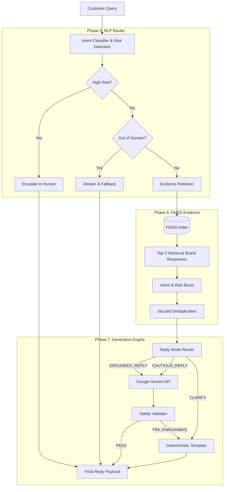

# Final Architecture: TrustSupport Customer Support Agent

The TrustSupport system is an ML-powered, evidence-grounded generative AI customer support agent. It enforces safety and determinism via a hybrid architecture separating semantic classification, risk detection, historical evidence retrieval, and reply generation.



## System Components

### 1. Intent Classification (Phase 5)
- **Model**: `all-MiniLM-L6-v2` SentenceTransformer embeddings + Logistic Regression classifier.
- **Taxonomy**: 13 granular gaming support intents (e.g., `CONNECTION_AND_TECHNICAL`, `PURCHASE_AND_BILLING`).
- **OOD Detection**: Centroid Distance Thresholding.

### 2. Deterministic Risk Detection
- **Mechanism**: Rule-based regex scanning against `BAN_APPEAL` and `LEGAL_THREAT` dictionaries.
- **Function**: Operates orthogonally to semantic intent to guarantee business-critical locks and immediate escalation.

### 3. Evidence Retrieval (Phase 6)
- **Index**: `FAISS IndexFlatIP` (384 dimensions, L2 Normalized).
- **Corpus**: `intent_train.jsonl` (Historical ATVIAssist brand responses).
- **Retrieval Pipeline**:
  - Global Top-20 Cosine Similarity.
  - +0.05 score boost for intent alignment.
  - +0.05 score boost for risk flag alignment.
  - Jaccard Similarity (>0.8) deduplication.
  - Hard cutoff at 0.40 raw similarity.

### 4. Generative Engine & Fallback (Phase 7)
- **Primary Generator**: `gemini-3.5-flash` using `google-genai` SDK.
- **System Prompting**: Contextualized strictly using retrieved evidence metadata, blocking assumptions, promises, or URL generation without evidence.
- **Fallback Generator**: If the Gemini API fails, API keys are missing, or the `SafetyValidator` catches a hallucination, a zero-latency `TemplateGenerator` takes over to provide a safe, non-hallucinated response mapped to the predicted intent.

### 5. Provenance & Safety
- **Safety Validator**: Strict regex post-processing filter. Blocks unauthorized promises ("refund", "unban", "guarantee") and external URLs not explicitly contained in the retrieved historical evidence.
- **Payload**: The system returns a comprehensive JSON structure that guarantees complete observability:
  ```json
  {
      "reply_text": "...",
      "reply_mode": "GROUNDED_REPLY",
      "intent": "PURCHASE_AND_BILLING",
      "generation_source": "GEMINI_API",
      "fallback_used": false,
      "safety_validation": {"passed": true, "reason": "No policy violations"}
  }
  ```
